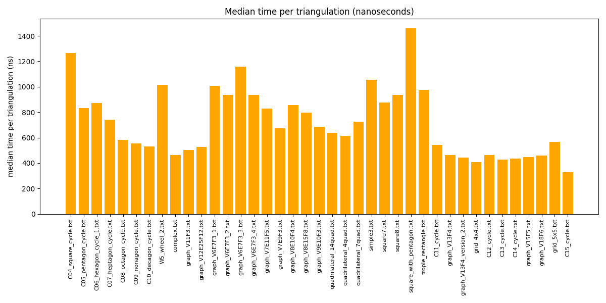
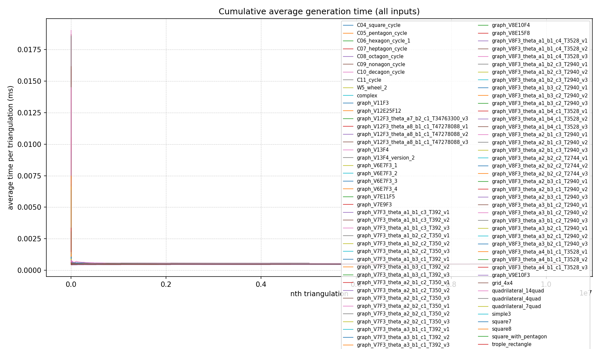

<div align="center">

# Generating All Triangulations of Biconnected Plane Graphs

**Amortized constant time per triangulation · O(n) space · Full experimental validation**

[](LICENSE)
[](https://isocpp.org/)
[](https://www.python.org/)
[](buetcseugthesis.pdf)

*B.Sc. Thesis · Department of Computer Science and Engineering*  
*Bangladesh University of Engineering and Technology · June 2026*

**Tawkir Aziz Rahman** (2005090) · Supervised by **Dr Md Saidur Rahman**

[📄 Read the Thesis (PDF)](buetcseugthesis.pdf) · [📓 Kaggle Notebook](https://www.kaggle.com/code/tawkirazizrahman/thesis-triangulation-generation)

</div>

---

## Abstract

We present an algorithm for generating **all triangulations of a biconnected plane graph** with *n* vertices in **O(1) amortized time per triangulation** and **O(n) space**. The algorithm establishes a double-layer tree structure — a recursive tree for each face combined with a genealogical tree for triangulation enumeration — and applies a novel **safe root vertex** selection with **blocking-chord pruning** to resolve the multi-edge problem unique to biconnected graphs.

To the best of our knowledge, this is the **first algorithm** for generating all triangulations of a given biconnected plane graph at amortized constant time per output. This repository contains the complete C++ implementation, correctness proofs via cross-validation, and two complementary performance analysis suites.

---

## Table of Contents

- [Repository Overview](#repository-overview)
- [Project Structure](#project-structure)
- [Core Implementation](#core-implementation)
- [Correctness Verification](#correctness-verification)
- [Time Complexity Benchmarks](#time-complexity-benchmarks)
- [Per-Triangulation Timing Analysis](#per-triangulation-timing-analysis)
- [Thesis & Documentation](#thesis--documentation)
- [Installation & Usage](#installation--usage)
- [Input Format](#input-format)
- [Results Summary](#results-summary)
- [References](#references)

---

## Repository Overview

This repository is organized into **four self-contained modules**, each with its own build target, input datasets, and analysis outputs:

| Module | Purpose |
|--------|---------|
| **Root** | Core triangulation engine — run on a single graph |
| [`correctness/`](correctness/) | Cross-validate against the Parvez–Rahman–Nakano triconnected algorithm |
| [`time_complexity/`](time_complexity/) | Batch benchmarking — total time, memory, and per-triangulation cost |
| [`averageTimeGraph/`](averageTimeGraph/) | Fine-grained recording of cumulative average time at every triangulation |

```
                         ┌─────────────────────────────────────┐
                         │         buetcseugthesis.pdf         │
                         │   (full theoretical treatment)      │
                         └─────────────────┬───────────────────┘
                                           │
              ┌────────────────────────────┼────────────────────────────┐
              │                            │                            │
     ┌────────▼────────┐        ┌──────────▼──────────┐      ┌─────────▼─────────┐
     │  Core Engine    │        │    correctness/     │      │  time_complexity/ │
     │  main.cpp       │◄───────│  48 test graphs     │      │  522 benchmarks   │
     │  biconnected.hpp│        │  vs. triconnected   │      │  time + memory    │
     └────────┬────────┘        └─────────────────────┘      └─────────┬─────────┘
              │                                                         │
              └────────────────────────┬────────────────────────────────┘
                                       │
                            ┌──────────▼──────────┐
                            │  averageTimeGraph/  │
                            │  per-triangulation  │
                            │  cumulative timing  │
                            └─────────────────────┘
```

---

## Project Structure

```
Thesis/
│
├── 📄 buetcseugthesis.pdf              # Complete B.Sc. thesis (June 2026)
├── 📓 thesis-triangulation-generation.ipynb
│
├── ── Core Implementation (root)
│   ├── main.cpp                        # Single-graph triangulation generator
│   ├── biconnected.hpp                 # Biconnected graph class & enumeration engine
│   ├── FaceTriangulation.hpp           # Per-face genealogical tree traversal
│   ├── Edge.hpp                        # Edge representation (normalized pairs)
│   ├── pairHash.hpp                    # Hash function for edge-pair storage
│   ├── input.txt                       # Default sample input
│   └── output.txt                      # Generated triangulations
│
├── 📂 correctness/                     # Algorithm correctness verification
│   ├── main.cpp                        # Batch comparison harness
│   ├── triconnected.hpp                # Reference triconnected algorithm
│   ├── ParvezRahmanNakano.hpp          # PRN algorithm utilities
│   └── input/                          # 48 diverse test graphs
│
├── 📂 time_complexity/                 # Aggregate performance benchmarking
│   ├── main.cpp                        # Multi-run benchmark driver
│   ├── plot_results.py                 # Visualization script
│   ├── results.csv                     # 522 benchmark records
│   ├── results.html                    # Interactive HTML report
│   ├── results.txt                     # Human-readable summary
│   ├── input/
│   │   ├── small/                      # 76 graphs (cycles, wheels, grids, …)
│   │   ├── medium/                     # 304 graphs (parametric θ-graphs)
│   │   └── big/                        # 142 graphs (up to 13-vertex cycles)
│   └── graphs/                         # Generated performance plots
│
├── 📂 averageTimeGraph/                # Per-triangulation timing profiler
│   ├── main.cpp                        # Records timestamp at every triangulation
│   ├── plot_results.py                 # Cumulative average time plots
│   ├── biconnected.hpp                 # Extended with onTriangulationGenerated hook
│   ├── input/
│   │   ├── small/                      # 76 test graphs
│   │   ├── medium/                     # 8 medium-scale graphs
│   │   └── test_single/                # Single-graph smoke test
│   ├── results/                        # Per-input CSV timing traces
│   └── graphs/                         # 80+ cumulative-average plots
│
├── 📂 paper/                           # LaTeX thesis source
│   ├── main.tex
│   ├── references.bib
│   └── main.pdf
│
├── 📂 presentation/                      # Beamer defense slides
│   ├── main.tex
│   └── main.pdf
│
├── ParvezRahmanNakano.md               # Reference paper (markdown)
└── ParvezRahmanNakano2011.15.3.pdf     # Original PRN 2011 paper
```

---

## Core Implementation

The root directory contains the production triangulation engine. A biconnected planar graph is represented as a collection of polygonal **faces**; the algorithm enumerates all valid triangulations by coordinating per-face genealogical trees while maintaining global edge consistency.

### Key Components

| File | Role |
|------|------|
| `biconnected.hpp` | Graph state, edge-presence tracking, triangulation accumulation |
| `FaceTriangulation.hpp` | Recursive face triangulation via chord-flip genealogical tree |
| `Edge.hpp` | Canonical edge pairs `(min, max)` for set operations |
| `pairHash.hpp` | Custom hash for `unordered_set<pair<int,int>>` |

### Algorithm Highlights

1. **Double-layer tree structure** — recursive decomposition per face, genealogical enumeration within each face
2. **Safe root vertex selection** — prevents the multi-edge conflict inherent in biconnected (but not triconnected) graphs
3. **Blocking-chord pruning** — restricts diagonal flipping to valid configurations only
4. **Constant-time structural updates** — all inner-loop operations are O(1), yielding O(1) amortized time per triangulation

### Complexity

| Metric | Bound |
|--------|-------|
| Time per triangulation | **O(1)** amortized |
| Total time | **O(T)** where *T* = number of triangulations |
| Space | **O(n)** where *n* = number of vertices |

---

## Correctness Verification

The [`correctness/`](correctness/) module validates our biconnected algorithm against the established **Parvez–Rahman–Nakano (2011)** triconnected algorithm. For each test graph, both algorithms independently generate all triangulations; results are sorted and compared edge-by-edge.

### Verification Strategy

```
  Input Graph
       │
       ├──────────────────┬──────────────────┐
       ▼                  ▼                  │
  Biconnected Algo   Triconnected Algo       │
  (our algorithm)    (PRN reference)          │
       │                  │                  │
       ▼                  ▼                  │
  Sort & Compare ◄────────┘                  │
       │                                     │
       ▼                                     │
  ✓ Match / ✗ Mismatch                      │
```

### Test Suite — 48 Graphs

| Category | Examples | Purpose |
|----------|----------|---------|
| **Cycles** | `C4_square_cycle`, `C5_pentagon_cycle`, … `C9_nonagon_cycle` | Catalan-growth stress tests |
| **Wheels** | `W4_wheel`, `W5_wheel_1`, `W5_wheel_2` | Hub-and-spoke structures |
| **Complete graphs** | `K3_triangle`, `K4_tetrahedron_1`, `K2_3_bipartite` | Dense connectivity |
| **Diamonds** | `diamond_1`, `diamond_2`, `diamond_3` | Separation-pair edge cases |
| **Quadrilaterals** | `quadrilateral_4quad`, `quadrilateral_14quad` | Multi-face coordination |
| **Parametric** | `graph_V5E7F3`, `graph_V12E25F12`, … | Varied vertex/edge/face counts |
| **Complex** | `complex`, `triangulated_9tri`, `octahedron_dual_tetrahedra` | Real-world planar structures |

### Build & Run

```bash
cd correctness
g++ -std=c++17 -O3 -o verify main.cpp
./verify
```

Expected output: green **Matched** for every file in `input/`.

---

## Time Complexity Benchmarks

The [`time_complexity/`](time_complexity/) module performs rigorous aggregate benchmarking across **522 test instances** (76 small + 304 medium + 142 big graphs). Each instance is run **10 times**; the driver records mean, median, min, max, standard deviation, peak RSS memory, and nanoseconds per triangulation.

### Metrics Recorded

| Column | Description |
|--------|-------------|
| `vertices` | Number of distinct vertices |
| `triangulations` | Total triangulations generated |
| `meanTime` / `medianTime` | Execution time (seconds) |
| `perTriangNs` | Nanoseconds per triangulation |
| `peakMemory` | Peak resident set size (bytes) |
| `memoryPerVertex` | Normalized memory usage |

### Key Findings

**O(1) amortized time per triangulation** — median cost stays near **~500 ns** even as triangulation count grows from 2 to billions:

<p align="center">
  
  <br/>
  <em>Figure 1 — Median time per triangulation (nanoseconds) across 522 benchmark instances</em>
</p>

**O(T) total time** — log-log regression confirms linear scaling between total triangulations and total execution time (slope ≈ 1):

<p align="center">
  
  &nbsp;
  
  <br/>
  <em>Figure 2 — Total time vs. triangulation count (log-log). Left: mean with error bars. Right: regression envelope.</em>
</p>

### Representative Benchmark Data

| Instance | Vertices | Triangulations | Median Time | ns/Triangulation |
|----------|----------|----------------|-------------|------------------|
| `C04_square_cycle` | 4 | 2 | 2.5 µs | 1,401 |
| `C08_octagon_cycle` | 8 | 4,872 | 3.0 ms | 624 |
| `C10_decagon_cycle` | 10 | 474,180 | 258 ms | 544 |
| `C11_cycle` | 11 | 5,010,456 | 2.73 s | 546 |
| `C12_cycle` | 12 | 54,721,224 | 25.3 s | 462 |
| `C13_cycle` | 13 | 613,912,182 | 262.8 s | 428 |
| `C14_cycle` | 14 | 7.04 × 10⁹ | ~51 min | 435 |
| `C15_cycle` | 15 | 8.23 × 10¹⁰ | ~7.5 hr | — |

### Build & Run

```bash
cd time_complexity
g++ -std=c++17 -O3 -o benchmark main.cpp
./benchmark

# Generate plots from results
python3 plot_results.py results.csv
# → graphs/*.png, results.html
```

---

## Per-Triangulation Timing Analysis

While `time_complexity/` measures **aggregate** performance, [`averageTimeGraph/`](averageTimeGraph/) records a timestamp at **every single triangulation** during generation. This produces fine-grained cumulative-average curves that reveal whether per-triangulation cost truly stabilizes over long runs.

### How It Works

```
For each triangulation generated:
  1. Record elapsed nanoseconds since run start
  2. Write CSV: triangulation_n, incremental_ns, cumulative_avg_ns
  3. Plot cumulative average time vs. nth triangulation
```

The `biconnected` class is extended with an `onTriangulationGenerated` callback hook that fires after each triangulation is produced.

### Key Results

After a brief initialization spike, cumulative average time **converges to a flat plateau** — confirming O(1) amortized behavior holds throughout the entire enumeration, not just on average across runs.

<p align="center">
  
  <br/>
  <em>Figure 3 — Cumulative average time per triangulation across all test inputs</em>
</p>

Individual cycle graphs demonstrate stabilization even at millions of triangulations:

<p align="center">
  
  &nbsp;
  
  <br/>

  
  &nbsp;
  
  <br/>
  <!-- <em>Figure 4 — Cumulative average time: 6-cycle (474K triangulations) and 7-cycle (5M triangulations)</em> -->
</p>

> **Observation:** On the 11-cycle with 5,010,456 triangulations, average time per triangulation stabilizes at ~0.0006 ms (0.6 µs) after the first ~100,000 outputs — consistent with the ~500 ns aggregate measurements from `time_complexity/`.

### Build & Run

```bash
cd averageTimeGraph
g++ -std=c++17 -O3 -o timer main.cpp
./timer

# Plots are auto-generated; or run manually:
python3 plot_results.py results
# → graphs/<input_name>.png, graphs/combined.png
```

---

## Thesis & Documentation

| Document | Description |
|----------|-------------|
| [**buetcseugthesis.pdf**](buetcseugthesis.pdf) | **Complete B.Sc. thesis** — theory, proofs, algorithm pseudocode, experimental results |
| [paper/main.pdf](paper/main.pdf) | LaTeX-compiled paper version |
| [presentation/main.pdf](presentation/main.pdf) | Defense presentation slides |
| [ParvezRahmanNakano2011.15.3.pdf](ParvezRahmanNakano2011.15.3.pdf) | Original reference paper (PRN 2011) |
| [ParvezRahmanNakano.md](ParvezRahmanNakano.md) | Reference paper in Markdown |
| [thesis-triangulation-generation.ipynb](thesis-triangulation-generation.ipynb) | Interactive Kaggle notebook |

### Thesis Chapters

1. **Introduction** — Problem statement and prior work
2. **Preliminaries** — Graph-theoretic foundations
3. **Cycle Triangulation** — Root vertex, blocking chords, flip criterion, O(1) amortized proof
4. **Triconnected Extension & Multi-Edge Problem** — Why PRN fails on biconnected graphs; our solution
5. **Biconnected Algorithm** — Double-layer tree, safe root selection, complete algorithm
6. **Correctness & Complexity** — Formal proofs
7. **Experimental Results** — Benchmarks presented in this repository

---

## Installation & Usage

### Prerequisites

- **C++17** compiler (`g++`, `clang++`, or MSVC)
- **Python 3.8+** with `pandas`, `matplotlib`, `numpy` (for plotting only)
- **LaTeX** (optional, for compiling `paper/` or `presentation/`)

```bash
pip install pandas matplotlib numpy
```

### Quick Start — Single Graph

```bash
# From repository root
g++ -std=c++17 -O3 -o main main.cpp
./main
# Reads input.txt, writes output.txt
```

### Full Pipeline

```bash
# 1. Verify correctness
cd correctness && g++ -std=c++17 -O3 -o verify main.cpp && ./verify && cd ..

# 2. Run aggregate benchmarks
cd time_complexity && g++ -std=c++17 -O3 -o benchmark main.cpp && ./benchmark && cd ..

# 3. Record per-triangulation timing
cd averageTimeGraph && g++ -std=c++17 -O3 -o timer main.cpp && ./timer && cd ..
```

---

## Input Format

All modules share the same graph input format — a planar embedding as a list of faces:

```
<number_of_faces>
<face_1_size> <v1> <v2> ... <vn>
<face_2_size> <v1> <v2> ... <vn>
...
```

**Example** — two faces sharing edge (0, 2):

```
2
3 0 1 2
4 0 2 3 4
```

Vertices are 0-indexed integers. Each face is listed in counter-clockwise order along the outer boundary.

---

## Results Summary

| Metric | Value |
|--------|-------|
| Correctness test cases | **48 / 48 passed** |
| Aggregate benchmarks | **522 instances** |
| Per-triangulation traces | **80+ graphs** |
| Smallest instance | 4 vertices, 2 triangulations |
| Largest instance | 15-cycle, 82.3 billion triangulations |
| Time per triangulation | **~500 ns** (O(1) amortized) |
| Space complexity | **O(n)** linear |
| Peak memory (typical) | 4–8 KB for graphs ≤ 16 vertices |

---

## References

**[1]** Parvez, M. T., Rahman, M. S., & Nakano, S. (2011).  
*Generating All Triangulations of Plane Graphs.*  
Journal of Graph Algorithms and Applications, 15(3), 457–482.  
[DOI: 10.7155/jgaa.00232](https://doi.org/10.7155/jgaa.00232)

**[2]** Li, X., & Nakano, S. (2005).  
*Generating all biconnected plane graphs.*  
Journal of Graph Algorithms and Applications, 9(2), 141–152.

**[3]** Hurtado, F., & Noy, M. (1999).  
*Graph of triangulations of a convex polygon and tree of triangulations.*  
Computational Geometry, 13(3), 179–188.

**[4]** Preparata, F. P., & Shamos, M. I. (1985).  
*Computational Geometry: An Introduction.* Springer-Verlag.

---

<div align="center">

**Tawkir Aziz Rahman** · Bangladesh University of Engineering and Technology  
Department of Computer Science and Engineering · June 2026

*Generating All Triangulations of Biconnected Plane Graphs in Amortized Constant Time Per Triangulation*

</div>
